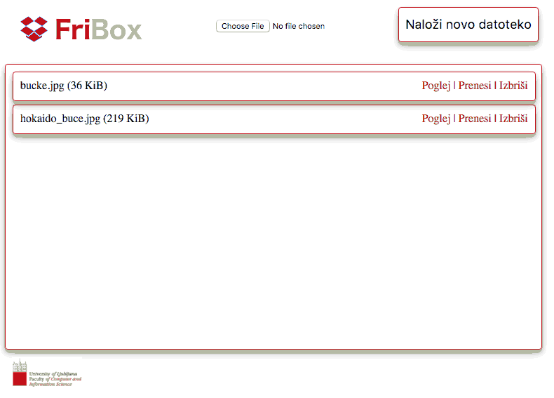

# Razvoj na strežniku z uporabo Node.js

3\. vaje pri predmetu [Osnove informacijskih sistemov](https://ucilnica1516.fri.uni-lj.si/course/view.php?id=54) (navodila)

## Spletna storitev FriBox

Na [GitHub](https://github.com) je na voljo javni repozitorij [https://github.com/lovre/fribox](https://github.com/lovre/fribox), ki vsebuje nedelujočo spletno storitev FriBox. FriBox predstavlja napredno storitev za oblačno shranjevanje in deljenje datotek. Kot izvrstna spletna aplikacija posega na izjemno konkurenčno področje obstoječih tovrstnih rešitev. V okviru vaj ustvarite kopijo repozitorija ter popravite in dopolnite obstoječo implementacijo tako, da bo končna aplikacija z vsemi delujočimi funkcionalnostimi izgledala kot na sliki spodaj. Med delom smiselno uveljavljajte spremembe v lokalnem in oddaljenem repozitoriju!

## Navodila za vaje

1. Na [GitHub](https://github.com) z uporabo funkcije _Fork_ ustvarite lastno kopijo javnega repozitorija [https://github.com/lovre/fribox](https://github.com/lovre/fribox) v okviru katere boste opravljali vaje. V razvojnem okolju [Cloud9](https://c9.io) uvozite pravkar ustvarjen [GitHub](https://github.com) repozitorij z uporabo funkcije _Clone to edit_ ter privzetimi nastavitvami.

2. V JSON datoteki _package.json_ aplikaciji dodelite odvisne knjižnice _mime_, _formidable_ in _fs-extra_ ter jih naložite z ukazom `npm install`. V Node.js aplikaciji _FriBox.js_ popravite implementacijo tako, da le-ta zažene strežnik na privzetih vratih. Nato zaženite aplikacijo _FriBox.js_ z ukazom `node FriBox.js` ter preverite osnovno delovanje.

3. V JavaScript skripti _skripta.js_ popravite implementacijo tako, da se pri nalaganju strani izvede funkcija `pridobiSeznamDatotek()`, ki pridobi seznam datotek iz strežnika. Popravite tudi samo implementacijo funkcije tako, da dejansko pošlje zahtevek za seznam datotek spletni storitvi `/datoteke`.

4. V JavaScript skripti _skripta.js_ popravite implementacijo tako, da bo izpis seznama datotek prilagojen velikosti posamezne datoteke. Izpis velikosti datotek naj bo v _B_ v kolikor je velikost datoteke manjša od _KiB_, v _KiB_ v kolikor je velikost datoteke manjša od _MiB_, v _MiB_ v kolikor je velikost datoteke manjša od _GiB_ itd.

5. V Node.js aplikaciji _FriBox.js_ popravite implementacijo tako, da se ob klicu spletne storitve `/poglej` odjemalcu posreduje datoteka z uporabo funkcije `posredujeStaticnoVsebino()`. Nato v JavaScript skripti _skripta.js_ popravite implementacijo tako, da vsem datotekam dodate gumb `Poglej`, ki z uporabo spletne storitve `/poglej` izbrano datoteko prikaže v novem zavihku.
   
6. Node.js aplikaciji _FriBox.js_ dodajte implementaciji dveh funkcij za posredovanje HTTP napak `404` in `500`. Funkciji uporabite na ustreznih mestih v aplikaciji, ki so označeni s komentarjem `//Posreduj napako`.

7. V Node.js aplikaciji _FriBox.js_ dodajte implemetacijo funkcije `izbrisiDatoteko()`, ki z uporabo funkcije `fs.unlink()` izbriše posredovano datoteko ter vrne ustrezen odgovor. Nato v JavaScript skripti _skripta.js_ poiščite napako v implementaciji zaradi katere je moč izbrisati le prvo datoteko na strani. Popravite implementacijo tako, da bo moč izbrisati poljubno datoteko ter preverite delovanje.
	
8. (__za hrabre__) V Node.js aplikaciji _FriBox.js_ pri nalaganju datotek dodajte preverjanje ali datoteka z enakim imenom že obstaja. V tem primeru posredujte HTTP napako `409`.
